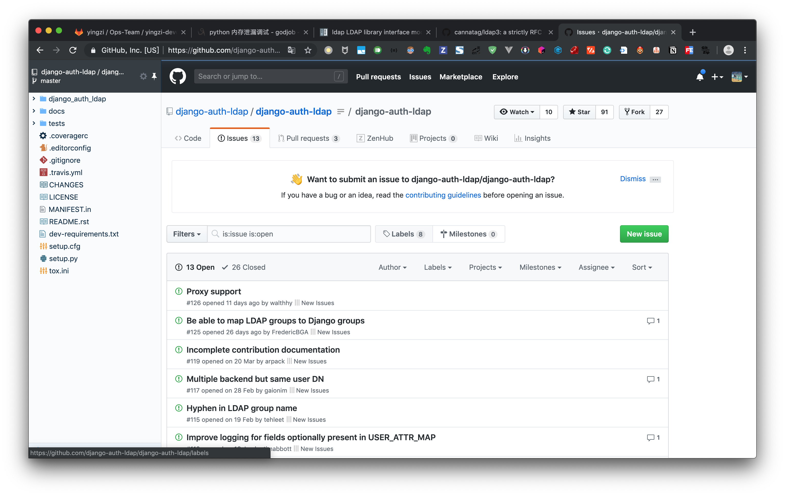
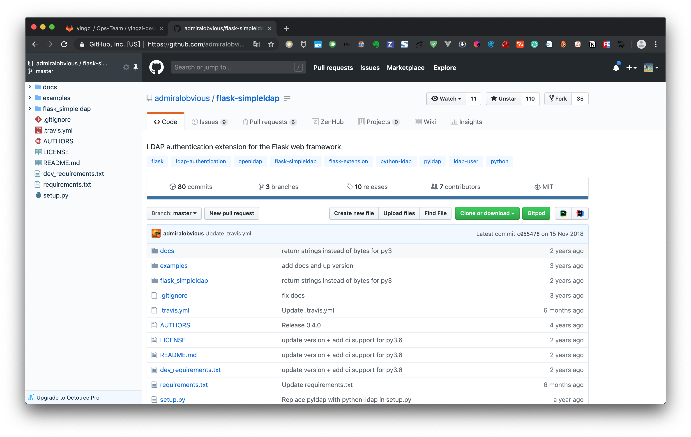

# ldap 连接问题

基于 [python-ldap](https://github.com/python-ldap/python-ldap)

连接关闭问题 使用`conn.unbind_s()`方法

## django

https://github.com/django-auth-ldap/django-auth-ldap

> jumpserver 使用的 ldap 认证开源项目

## flask

https://github.com/admiralobvious/flask-simpleldap

[内存泄漏](https://www.cnblogs.com/UnGeek/p/5984880.html) 不过是两年多发生的事情，现在不知道还有没有